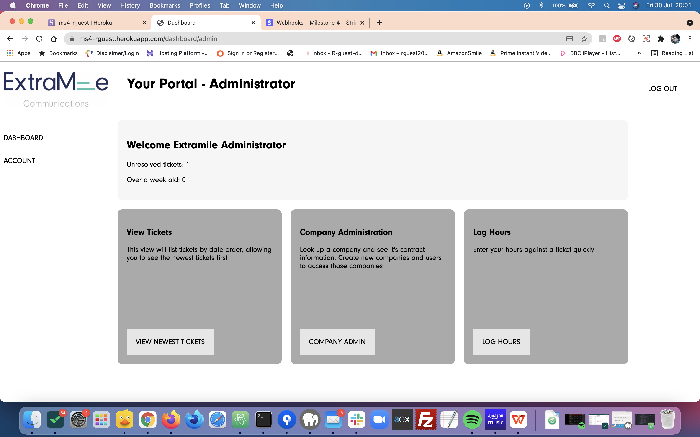
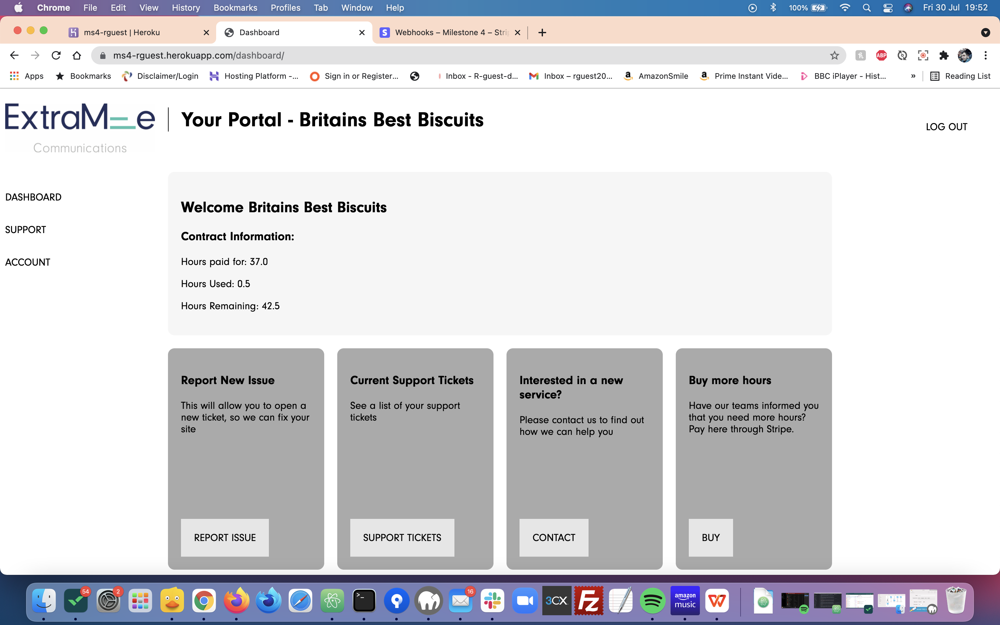

# **EMC Ticketing - MS4**

# **Pre-development**

**Functional specifications - Given by Code Institute**
- LO1	Design, develop and implement a full stack web application, with a relational database, using the Django/Python full stack MVC framework and related contemporary technologies.
- LO2	Design and implement a relational data model, application features and business logic to manage, query and manipulate relational data to meet given needs in a particular real-world domain.
- LO3	Identify and apply authorisation, authentication and permission features in a full stack web web application solution
- LO4	Design, develop and integrate an e-commerce payment system in a cloud-hosted full stack web application
- LO5	Document the development process through a git based version control system and deploy the full application to a cloud hosting platform.

**What this means**
- Build a web application that is powered with a relational database
- Ensure UX design is considered throughout, producing a site that is functional and easily navigable
- Create a website using the principles of MVCs using Python as a back end language.
- Deploy correctly and without error to the Heroku platform
- Ensure that secret keys are hidden within the GitHub platform, so that the site is less vulnerable to attack.
- Ensure the website is standard in terms of style.
- Ensure that there is accessibility even for those people who use assistive technology
- Make sure the website responds to different devices.  No point in a website that breaks when viewed on mobile.
- Static website produced using HTML (passing quality check)
- Styled using CSS and bootstrap (passing quality check)
- JavaScript not required, but can be implemented. For example, bootstrap will use JQuery.
- No Lorem ipsum text.
- Ensure this is fully documented and commented to be clear to any developer reading through.

**What I will build**
To ensure that I hit these targets, I intend to build a ticketing application for the web agency at which I work.  This will be a multi app django project that will allow clients to log tickets and pay for extra time and the agency to respond, log time against those tickets and monitor client details.

**User stories**

**First Time Users**

- Geoff:
Geoff is a COO of a small business who has taken a site out with Extra Mile.  Geoff is not technophobic, but struggles with complex terminology.  Geoff would like an easy to access site where he can log issues and see how his investment is moving along.

- Francis:
Francis is a Marketing Lead for a multinational company.  Francis would like to be able to get in touch quickly with ExtraMile in the event that the site goes down or other issues occur.  Francis would also like to be able to purchase more time if required

- Tim:
Tim is a new member of the projects team at ExtraMile.  He does not yet know the companies well and is feeling a little overwhelmed at the wealth of information he needs to have access to.  Tim would like a quick easy way to track how a company is doing and be able to respond if any client raises an issue.

**Hitting these targets**
- To ensure that I hit these targets for first time users, I have made sure that the site was designed and built with UX in mind.  All buttons and call to actions are obvious and their outcomes are also obvious. The dashboard contains all the links that would be needed by either clients or ExtraMile to monitor the status of the tickets.  Some extra information is also given on the dashboard.

**Returning User**
- Caroline:
As a seasoned developer at ExtraMile, Caroline knows how to deal quickly with issues and would like a quick and easy method by which she can log her hours and move on to the next ticket.

- Henrietta:
Henrietta likes to ensure everything is 'just so' and will send several emails through to ExtraMile on a daily basis.  If there is an easy system by which she can send multiple messages to advise on a developing situation then she is happy with it.  Unfortunately Henrietta is also severely colourblind and does not like clashing difficult to see screens.

**Hitting these targets**
- Upon entry to the admin dashboard there is a log button that allows admins to quickly and easily log time against certain tickets.  Constant time tracking is available on the dashboard for clients as well.  To keep with accessibility requirements, the site is in grayscale.

**Entity Relationships**

There are many interconnected parts of the database.  These have been kept non-relational to abide by the coursework criteria:

**Preliminary Designs**
These can be found [here](emc-customer-portal--wireframing-21404510.pdf "Wireframes")

**Features**

- Responsive on all device sizes
- Database functionality driven
- HTML/CSS/Javascript
- Built in Python (Django)
- Protected with hCaptcha

# **Post-Development**

To access the page go to your favourite browser and type &quot;[https://ms4-rguest.herokuapp.com/](https://ms4-rguest.herokuapp.com/)&quot; into the search bar. The code is hosted at &quot;[https://github.com/rguest20/MS4-1](https://github.com/rguest20/MS4-1)&quot;.

**Dependencies**

**HTML**

I am using HTML 5 and this is shown by the use of the <html> tag used at the start of the document. This comes with all of the semantic markup that I need to ensure that the code is easy to read and debug if necessary.

**CSS/CSS Grid/LESS**

To style the page, a mixture of CSS and the newer library CSS Grid was used to keep the site looking neat.  Checks were performed to ensure that, in the event of a browser that did not support grid, the site would look ok.  

- LESS
The CSS was compiled in this case using the LESS preprocessor.  This ensures that all CSS is compiled in terms of specificity and with little to no mistakes.

**JavaScript**

To help with the smooth running and operation of the site, i have created a javascript file within my static files that keeps the site operational.

- Gulp(v4)
I created a gulpfile to compile the javascript and less files into a single js file or css file.  This allowed me to use the power of LESS to ensure that my CSS is built in a functional and elegant way.

**Python**

Python was used as the fundamental language in which the site was built and the following modules were utilized and would be required if rebuilt:

Core flask modules
- django
- datetime
- dnspython
- python-dotenv
- django-tinymce
- django-jsonify
- psycopg2

Extension modules
- python-dotenv (for storing secrets)
- stripe (for e-payments)
- whitenoise (help with serving static files)
- dj-database-url (to ensure that the database could be kept consistent across postgres and SQLite3)

Production module
- gunicorn

**How to use**

**Login Page**
Upon login there is either a login form or a registration form.  However, the registration form will not allow access to the site without an admin linking your account to a company.  There is a hCaptcha field to prevent bot spamming.  

**Dashboard page**

For both the admin and client there are dashboard with obvious call to actions available below.  The menu on the side allows for fast navigation of the site.  A short explanation of each call to action is given on the page.

**Ticketing page**

**Account page**

**Payment pages**

**Company Admin page**

**UX design**

To make the design more user friendly I have done the following:

- To ensure that accessibility is not an issue for colorblind people, I have tested the website using the toptal.com colorblind site checker in achromatopsia setting that renders the page in greyscale.  All links and CTAs were still visible.

- CTAs and links are made obvious by ensuring that they change colour when hovered and keeping consistent buttons.
- Colour contrast was checked to ensure readibility
- All buttons are clickable and take you to the expected area of the site.
- Any required form sections will flag if not filled in.
- Messages added to inform users if they have caused an error.
- If a person is not logged in, they will be redirected to the register page if they attempt to access any area that they should not.  
- Potentially more vital parts of the site will only accept POST requests.  This makes it difficult for someone to accidentally cause damage to the database.

# **Testing**

**Manual Testing**
All aspects of the site has experienced a lot of manual testing.  
- Account creation - Tested and working
- Company creation - Tested and working
- Account linking - Tested and working
- Account Removal - Tested and working
- Hours logging - Tested and working
- Company lookup - Tested and working
- Ticket creation - Tested and working
- Comment creation  - Tested and working
- Ticket editing - Tested and working
- Ticket and comment readable by interested parties  - Tested and working
- Payment system - Tested and working
- Webhooks  - Tested and working

An example of the testing done is available 

**W3C Validator**

- HTML

Only one warning that was resolved by setting a content-language meta tag.  This gets around the fact that flask_bootstrap does not have a lang set in the HTML tag

- CSS

One error detected in bootstrap module.  No errors in my CSS

**GitGuardian Check**
GitGuardian was used to ensure that no secrets were revealed in my git log.  The results can be seen [here](docs/gitguardian.png "GitGuardian Log")

# **Deployment**

**Do Not Deploy To GitHub Pages – Python does not work on GitHub Pages**

**Forking the GitHub Repository**

By forking the GitHub Repository we make a copy of the original repository on our GitHub account to view and/or make changes without affecting the original repository by using the following steps...

1. Log in to GitHub and locate the [GitHub Repository](https://github.com/)
2. At the top of the Repository (not top of page) just above the &quot;Settings&quot; Button on the menu, locate the &quot;Fork&quot; Button.
3. You should now have a copy of the original repository in your GitHub account.

**Making a Local Clone**

1. Log in to GitHub and locate the [GitHub Repository](https://github.com/)
2. Under the repository name, click &quot;Clone or download&quot;.
3. To clone the repository using HTTPS, under &quot;Clone with HTTPS&quot;, copy the link.
4. Open Git Bash
5. Change the current working directory to the location where you want the cloned directory to be made.
6. Type git clone, and then paste the URL you copied in Step 3.

$ git clone https://github.com/rguest20/ms4-1

1. Press Enter. Your local clone will be created.

$ git clone https://github.com/YOUR-USERNAME/YOUR-REPOSITORY

\> Cloning into `CI-Clone`...

\> remote: Counting objects: 10, done.

\> remote: Compressing objects: 100% (8/8), done.

\> remove: Total 10 (delta 1), reused 10 (delta 1)

\> Unpacking objects: 100% (10/10), done.

**Heroku Hosted App**
**Development**

The project was deployed to Heroku using the following steps...

1. Log in to Heroku and create a new app - use the python buildpack
2. Click the deploy bar and check the GitHub Deployment Method
3. locate the [GitHub Repository](https://github.com/)and copy the address of that page into the bar asking for origin
4. This will link to your GitHub account and deploy to the site when changes are detected.
5. Click the Settings bar and add the following Config Vars:
- SECRET_KEY: (this should be a difficult to guess string)
- : (this should be the url of the mongodb database that you intend to use with the app)
- : app.py
- : heroku
6. Check that the build has occurred as expected.
7. Enjoy your shiny new app, make any changes that are required whilst on a dev server.

**Production**

1. When ready to enter production, we are going to create app_wsgi.py and edit it so that it now says:
`import os

from django.core.wsgi import get_wsgi_application

os.environ.setdefault('DJANGO_SETTINGS_MODULE', 'emc_tickets.settings')

application = get_wsgi_application()`
2. Alter the procfile so that it now says `web: gunicorn emc_tickets.wsgi`
3. Create a runtime.txt and specify the version of python that you are running with `python-3.9.5`
4. Push to GitHub and let heroku build the app.  This will now be a production server without a debug mode.

**Credits**

**Code**

- [Django](https://www.djangoproject.com/): Lite Framework in which the app was built.

- [django-tinymce](https://django-tinymce.readthedocs.io/en/latest/): Tinymce feature for django websites.  Much nicer and more features than a standard textarea.

**Content**

- All content was written by the developer, design was aided by Shannon Wright at ExtraMile Communications.

**Media**

- The ExtraMile Logo is taken with permission from ExtraMile Communications.  It remains property of ExtraMile and it's use without seeking further permission is prohibited.

**Known issues/extensions to be added**

-
